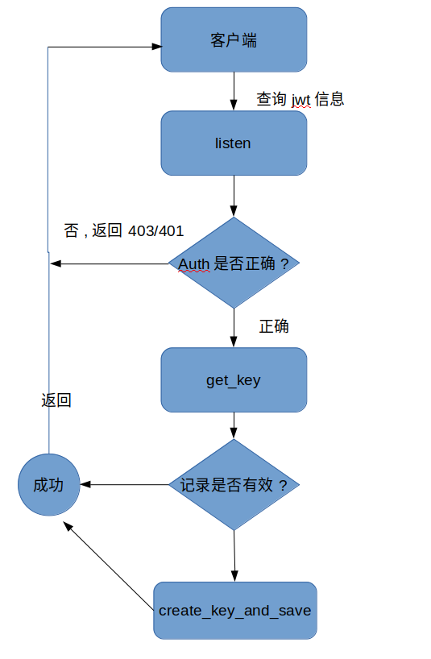

#JWT接口设计

## 功能

1. 提供JWT服务的secret(key)和algorithm(算法)查询服务
2. 接收jwt密文,解密后进行相关后继操作.

## 具体要求

一条jwt信息至少要包含以下信息

1. secret(key)
2. algorithm(算法)
3. 创建日期
4. 生命周期(有效时间)

### JWT服务的secret(key)和algorithm(算法)查询服务

查询服务要求无论何时,都能给用户提供有效的key和算法信息.其业务逻辑如下:

1. 客户端发起api查询请求.发起请求时, 请求头带上Auth字段作为身份验证
2. 服务器检测到查询请求后,检查请求头部是否由Auth? 如果没有Auth信息,则拒绝请求(返回401),否则比对Auth是否正确?不正确,拒绝请求(返回403),否则,进入下一步骤
3. 服务器查询数据库中最新的有效的jwt信息记录.如果没有,就生成一条有效信息并返回给客户端.如果有.就检查这条记录种的key是否超时了?
   > * 如果key超时了, 那就生成一条新的记录并返回给客户端.
   > * 如果即将超时(还有15分钟过期). 那就生成一条新的记录并返回给客户端.
   > * 其他情况.请直接返回信息

伪代码如下

```python3.6

def create_key_and_save():
    """
    辅助函数
    创建一条jwt记录并保存到数据库.
    然后返回这条记录
    """
    record = new MyJWT()  # 创建一条新的jwt记录
    db.save(record)       # 保存到数据库
    return record         # 返回记录

def get_key():
    """
    主函数
    从获取当前最新的jwt记录.
    """
    record = db.get_last()  # 从数据查询最新的记录.查询条件是以创建时间排序,倒序第一个
    if record is None:                         # 数据库是空的
        record = create_key_and_save()         # 调用函数重新生成一个新的记录并保存.
    else if record.创建时间 + record.生命周期 < 现在时间:
        """过期了,重新生成一个"""
        record = create_key_and_save()
    else if 现在时间 < record.创建时间 + record.生命周期 < (现在时间 + 15分钟):
        """将要过期,已经进入缓冲期了,重新生成一个"""
        record = create_key_and_save()
    else:
        """即没有过期也每进入缓冲期,正常的"""
        pass 
    return record           # 返回记录

def listen(request):
    """
    这是一个视图函数,用于监听客户端发来的获取key和算法信息的请求
    params request: 客户端发起的请求.
    return: 返回类型为json类型
    """
    headers = request.get_headers()            # 获取客户端发起的请求的头部信息
    if "Auth" not in headers:                  # 如果客户端没有Auth信息.
        return (403, '缺少Auth信息')
    else:
        auth = headers.get("Auth)              # 取出Auth信息
        if auth is '正确':
            record = get_key()                 # 取出有效的key和算法信息
            return record                      # 返回信息给客户端
        else:
            return (401, '错误的Auth信息')

```

#### 逻辑流程示意图

