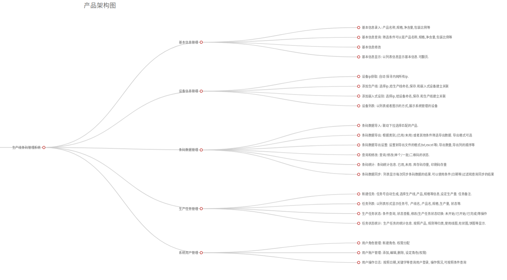

# 生产线管理项目

## 概述

一款用于生产线的条码管理的软件. 其重要目的是校验生产线上贴在商品上条码是否正确并记录在数据库中.

## 功能

1. 从外界导入空白条码到数据库
2. 分批导出数据库中的条码信息用于印刷的生产线消费
3. 校验生产线系统使用的条码是否合法
4. 导出数据库已使用过的条码信息
5. 生产线设备管理
6. 操作用户/权限管理

## 业务流程

1. 系统需要定期(每月)的从外界导入条码到系统中.以备生产任务消耗
2. 从系统中取出部分条码打印供当天的生产任务使用.
3. 生产线作业时, 校验生产线使用的条码是否合法.
4. 当日工作结束时. 生产线会吧当日消耗条码的回传给系统,系统会检查和记录这些条码的信息.
5. 定期把当月条码消费的情况从数据库导出成文件(备份保存)

开始之前,系统中数据库为空. 路要进行一些初始化工作.

### 初始化基本信息

* 用户可以在系统中录入生产线可能生产的产品的产品信息.包含产品名称,净含量,规模和包装比例等. 这些产品信息会在导出消费条码时和空白条码进行匹配

### 从外界导入空白条码到数据库

每月生产任务开始之前,或者系统中剩余的空白条码不足时.应到从外界(总公司数据库)导入空白条码.空白条码应该是不重复的,有一定格式的的条码.导入时:

* 识别导入的文件,可能包含不同类型的文件(txt,csv, xls, xml等)
* 正确识别文件的内容: 不同类型的文件有不同的内容格式,不同客户使用的内容格式也各不相同.
* 导入功能应该让用户预览文件的内容,并进行格式化显示.用户可以在操作界面标识哪些列是有效的条码字段.这种标识可以作为客户的配置文件保存下来.以备客户下次直接选择.
* 导入功能应该能识别有效的条码和无效的条码.
* 导入功能应该能对条码进行统计,对导入的结果进行校验.每次导入作业后,给出作业简报.让用户知晓本次导入作业: 从文件识别的条码数量,成功导入的数量.导入失败的数量等统计信息.
* 对于导入失败的条码,应该告知用户失败的原因.

### 从系统导出当日生产所需的消费条码

每日生产开始之前.从系统中导出部分条码信息,打印出来.打印出来的条码在生产时会被生产线上相关设备贴在产品上.

* 选择导出当日消费条码数量. 并根据生产任务,选择这些条码对应的产品信息(每日生产任务中所生产的产品是根据公司总的生产任务进行调整的).
* 导出的消费条码,应当在系统中进行标识.记录这些待消费的条码对应的产品信息.

### 校验条码

在每日生产时. 产品流经生产线设备,被贴上标签.同时.生产线上有一个光电感应设备扫描流动的产品并对其上粘帖的条码进行OCR识别.并把识别的结果传递到系统中进行校验.以检测此条码的正确性.

* 系统提供专用的Http和Tcp接口接收生产线设备的校验信息.其中http和tcp两种接口的请求和返回格式都不同.去要分别开发.
* 校验的返回信息只需包条码状态即可: 

  >1. 表示条码结果合格，为本产品当前合格条码
  >2. 不合格，读取的条码已被生产使用
  >3. 不合格，读取的条码不是本产品条码
  >4. 读取的条码格式不符合
  
* 校验条码的过程,系统只提供校验结果,并不进行记录.
  
### 回传消费过的条码到系统

每日生产结束后.由用户手动操作嵌入式设备,回传当日消费过的条码信息到信息保存.

注: *嵌入式设备是和生产线配套的,用于暂存当日消费条码信息的设备*

* 回传的接口同样提供http和tcp两种接口.
* 回传的结果应该在回传结束后就反馈给嵌入式设备.
* 回传的结果包含: 

  >1. 1代表本次请求接口处理成功
  >2. 0则代表本次接口处理数据失败
  
* 回传的数据系统会进行标识和保存.同时记录每日回传作业的时间和状态,以供查询.

### 导出月度条码消费信息

每月在生产中消费的条码,都会保存在系统中.在月底的时候,由用户一次性导出成文件.

* 根据客户的不同可能导出不同类型的文件(txt,csv, xls, xml等),
* 系统留给客户定义导出文件格式的界面.以方便用户定义.此导出文件可以作为用户配置文件保存,方便用户下次调用.

之外,为了保障系统正常运行. 还需一些辅助的功能

## 辅助的功能

### 用户管理

管理登录系统的账户和密码.系统暂定使用基于角色的权限管理方式

* 一个系统管理员权限组. 此组用户为管理员.拥有包括操作系统和管理权限和用户的全部权限.
* 一个来宾用户权限组.此组用户只能登录系统进行查看,其他操作一概无法执行.此权限组作为新增用户的默认权限组.
* 管理员可以自定义权限组. 加入权限组的用户即拥有此权限组定义的权限
* 管理员可以把自己的部分权限(比如添加用户等)赋予其他用户.

### 设备管理

用于管理生产设备.直观反映生产设备之间的关系和运作情况.
主要是记录生产线和嵌入式设备的信息

* 嵌入式设备信息包含: 设备名称/id, ip地址. 关联生产线名称/id
* 生产线设备信息包含: 生产线名称/id, ip地址, 关联嵌入式设备名称/id.另外,生产线还有下属子设备:

  >* 主控板, 主控板是生产线的子设备.主控板信息包含: 设备名称/id, ip地址(和生产线相同). 型号. 一个生产线可能包含多个主控板
  >* 控制板, 控制板是主控板的子设备.控制板信息包含: 设备名称/id, ip地址(也可能没有此信息),型号.一个主控板可能包含多个控制板

* 生产线和嵌入式设备是一一对应的

### 生产任务管理

生产任务就是为了方便管理,创建的跨越数天的工作计划.生产任务主要的目的是更直观的反映生产的情况.

* 生产任务包含:

  >* 关联的产品信息,包含产品名称,净含量,规模和包装比例.计划生产数量,一个生产计划只对应一种产品.
  >* 关联的生产线设备.
  >* 生产任务的会记录关联生产线已生产的产品信息(会在每次回传消费过的条码时更新生产线的生产信息)

### 日志系统

* 对用户的的操作进行基本的记录,包括用户的添加删除,数据的导出导入.
* 对系统运行的信息进行记录,比如 磁盘空间, 内存和处理器的使用情况. 
* 记录系统运行时的故障信息.

