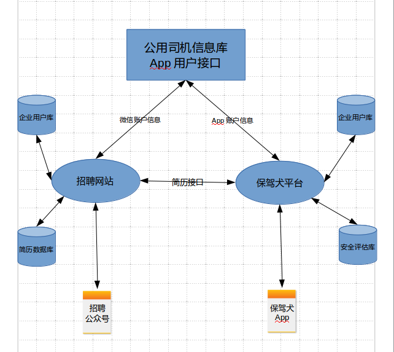

#保驾犬安全管理平台设计需求文档

2018-7-13

在说明保驾犬平台的设计需求之前.有必要对整个系统的架构做一个说明:
>系统架构由多个独立的平台或者站点组成.每个平台/站点都可独立运作.
招聘站点和保驾犬平台现阶段共用一个App客户端.
招聘站点的求职用户和保驾犬的物流司机用户,都由一个公用的App账户体系管理.双方的App账户通用.
招聘站点和保驾犬平台的企业用户由自己维护.
招聘站点和保驾犬平台通过接口互通数据.

整体架构示意图

保驾犬安全管理平台针对公司用户,提供对企业所属的司机的驾驶行为安全管理的功能. 主要功应至少包含一下几个部分: 账户系统, 人员, 车辆和组织架构的管理, 排班管理. 位置服务, 警告功能, 违章管理, 事故管理,安全模块, 报表模块.  在线报告, 接口部分.

###账户系统

####1. 超级管理员是整个平台的最高权限的用户:

>1. 拥有对全平台所有资源的访问权限.可以操作所有的功能.
>2. 创建/修改/停用/删除公司用户及公司名下的管理员账户.
>3. 用来登录保驾犬平台的是公司用户名下的账户.  公司用户名下有一个管理员账户和若干一般账户.公司的一般账户由公司管理员账户创建. 管理员和一般账户都可以登录保驾犬平台,访问公司用户 名下的资源.

####2. 管理公司用户
> 提供对保驾犬平台公司用户的管理功能, 包括公司用户的创建, 修改,停用,删除等. 公司用户一旦被停用,相关公司用户下的所有账户也同样被停用.

####3. 公司管理员账户
> 一个公司只有一个管理员账户, 管理员账户可以创建有限个一般账户(在账户管理页面).公司管理员账户拥有整个公司用户下所有资源的访问和修改的权限. 一般账户的权限由管理员账户进行设置.管理员可以随时停用/修改/删除一般账户.

####4. 公司一般账户
>一般账户的权限的权限由管理员账户赋予, 账户权限的访问级别针对不同的模块和功能可以分别设置为为 禁止(访问)/读/写(修改)三个不同的级别(比如A账户只能查看团队成员的权限,而B账户可以向团队中添加新成员),账户对资源的访问范围也包含在账户设置的范畴之内(比如A账户只能查看某分公司某部门的资源,而B用户可以查看某分公司的全部资源).

###人员管理
>进行司机入职/离职办理, 个人资料修改, 部门调动,职务变更,  个人基本统计信息(总行驶里程, 等)查看导出等操作(一般账户/管理员账户操作).

###部门管理
>对公司部门组成的管理, 包括部门基本信息的修改,主管领导的变更. 部门统计信息的查看等.(管理员账户操作)

###车辆管理
>对公司部门所属车辆, 包括车辆基本信息(车牌,车型,车架号发动机号等)的查看和修改,  维修记录的增删改查汇总导出等操作.(一般账户/管理员账户操作)

###排班管理

>1. 排班的增删改查.注意长途司机的工作特点.排班要有适当的灵活性.(一般账户/管理员账户操作)
>2. 司机, 车辆和排班三者的对应关系的管理(对应关系的查看,修改,删除查找等).

###位置服务

####位置服务包含实时位置服务和历史轨迹查询.

#####1. 实时位置服务
这里更像是一张电子地图,也是整个后台站点的首页.建议这里提供往常用功能的快捷方式.并在不影响视觉效果和功能的前提下,尽量显示更多的信息.
在电子地图上实时显示司机当前所在的位置(无需刷新页面). 尽量使用全双工协议或者其他手段保持位置信息的实时传输.定时刷新和Ajax技术不建议使用. 
初始化页面时既要考虑尽可能的显示更多的司机,也不能放地图缩放比例太大.注意由于公司的规模的大小差异很大.要避免同时显示用户过多造成的性能和视觉的问题.
在页面上显示简要的用户个人信息,以方便对用户身份进行快速的识别.
司机的当前安全指数, 可以考虑以简洁的方式提示.比如会把安全指数较低的司机标识出来..
在适当的缩放级别下,显示司机所在区域的天气和路况.
可以考虑用颜色标识一下处于(停车/正常行驶/超速)不同速度状态的司机.

#####2. 历史轨迹查询
按照用户和时间段显示对应的行车轨迹.
回放时显示车辆当时的时间和速度等简要信息.
轨迹的颜色根据速度的不同应有区别.
在轨迹上标注行车事件及简要信息.
在轨迹上标注违章事件及简要信息(如果有).
在轨迹上标注事故及简要信息(如果有).
在页面上显示对应的时间段的统计信息(里程,时长,行车事件数, 高危事件数等).

###警告功能
公司管理员可以在这里设置发生哪些事件(高风险的驾驶行为或者紧急事件/事故)的时候,以哪些方式?(弹窗/声音/短信/微信/语音电话?)提醒哪些人(当前账户/公司管理员/指定的联系人)? 
发送的警告提醒应存档可查(可按条件过滤).	
消息推送功能可从平台向App间推送即使消息

###违章管理
违章管理模块负责对公司名下的司机的违章记录的管理,包含如下功能:
定期查询违章记录.并把结果发送到客户的App上.
提供对违章记录的增删查(条件过滤)功能.查询结果可导出.
违章记录可以修改关联司机
注意违章查询的成本控制

###事故管理
事故管理模块负责对公司名下的司机的事故记录的管理,包含如下功能:
提供对事故记录的增删改查(条件过滤)功能.查询结果可导出.
提供司机利用App上报事故记录的接口

###安全模块
安全模块主要负责两方面的工作

>1. 安全相关事件分析(行车事件, 健康状况, 情绪感知)
>2. 司机安全指数的评估

事件分析中, 优先完成行车事件的分析,  健康和情绪的状况作为需求可以放在稍后的进度中完成.
司机安全指数需要综合行车事件 , 健康水平, 情绪状态, 违章记录, 事故记录, 车辆维修记录等综合得出. 指数本身要求能依赖其数值, 直观的反映司机驾车安全性的高低.

###报表模块
报表模块负责各类数据报表的生成, 记录, 呈现和导出. 数据的种类包含:  行车事件, 违章数据, 事故数据 , 警告记录, 安全指数等
报表模块应有着强大的筛选功能, 可以满足多种条件的过滤条件.
报表模块应能按不同的维度和粒度切分数据(比如按照不同的俺月统计全队安全指数的变化或按个人统计全队安全指数的排名).
报表模块可提供多种形式的图表用于以不同的表现方式呈现数据.(比如提供线图,柱装图,热力图等多种类型的图表形式)

###在线报告
此模块负责呈现,记录和统计司机的在线情况. 也作为衡量司机活跃度的一个工具.应具备以下功能:
以列表显示当前的在线情况. 可以不同的字段进行排序(比如按最后的登录时间的早晚,或者按照在线总时长的大小等)
按照不同的时间粒度(日/周/月等)统计在线情况(总人数,在线人数,  新增注册, 平均在线时常等),统计的也过可以导出.

###接口和实现
接口通讯的数据,与身份验证相关的数据使用JWT加密,非敏感数据和文件/图片/视频不加密传输.具体情况可协商
这一部分为提供的接口和实现的接口,向外提供的接口的接口可以被其他系统调用, 实现的接口是用来调用其他系统提供的功能.
	
####需要提供的接口	
警告功能模块下的消息推送.

####需要实现的接口
公用的App用户接口,用于App用户的注册/登录/信息修改
向招聘网站推送/修改/获取简历的接口	
